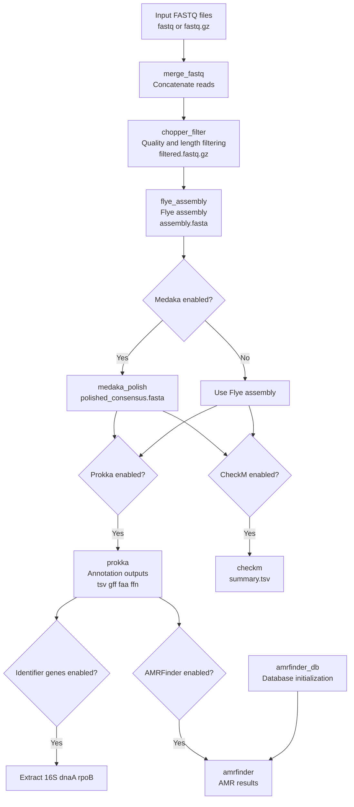

# ulana-ht
ULANA-HT is a Snakemake-based, multi-sample workflow for bacterial whole-genome assembly and downstream characterization from Oxford Nanopore long reads. It is a “high-throughput” (HT) reimplementation of the ULANA pipeline, designed to process many genomes in parallel.

## What it does
1) For each sample, the workflow can run:
1) Merge reads (supports .fastq and .fastq.gz)
1) Filter reads with chopper (quality + length)
1) Assemble with Flye
1) Polish with Medaka (optional)
1) Annotate with Prokka (optional)
1) QC with CheckM (optional)
1) Extract ID genes (16S rRNA, dnaA, rpoB) from Prokka output (optional)
1) AMR detection with AMRFinderPlus (optional)



These steps and toggles are defined in the Snakefile and config/config.yaml.

## Repository layout
 - `Snakefile` — workflow definition
 - `config/config.yaml` — parameters + feature toggles
 - `config/samples.tsv` — sample sheet (what files to process)
 - `envs/` — conda environment files per rule (Flye, Prokka, CheckM, AMRFinder, etc.)
 - `results/` — pipeline outputs (created during runs)
 - `logs/` — tool stderr logs (created during runs)

## Requirements

 - Linux recommended for production
 - conda (Miniconda/Anaconda/Mambaforge)
 - Snakemake 7+ strongly recommended (newer Snakemake handles conda activation much more reliably on modern systems)

# Installation

Create a dedicated Snakemake environment:
```
conda create -n snakemake -c conda-forge -c bioconda python=3.11 snakemake=8
conda activate snakemake
```

Clone the repo:
```
git clone https://github.com/ehill-iolani/ulana-ht.git
cd ulana-ht
```

# Running the pipeline

## Input: sample sheet
Edit config/samples.tsv (tab-delimited). It must include:
 - `sample` — sample name
 - `fastq` — path to reads file (`.fastq` or `.fastq.gz`)

Example (the repo includes an example like this):
```
sample	fastq
12-45-SW-A-1	data/12-45-SW-A-1_ONT.fastq.gz
18-T-HS-3-S-2-30-S	data/18-T-HS-3-S-2-30-S_ONT.fastq.gz
```

## Configuration
Edit config/config.yaml to control parameters and enable/disable modules. The current defaults include:
 - `chopper`: `q` and `minlength`
 - `flye`: mode (e.g. `--nano-hq`)
 - `medaka`: `enabled`, `model`
 - `prokka`: `enabled`
 - `checkm`: `enabled`
 - `id_genes`: `enabled`
 - `amrfinder`: `enabled`

## Execute the workflow
Basic run (local machine):
```
snakemake --cores 16 --use-conda --rerun-incomplete --latency-wait 60
```

Server run (example):
```
snakemake --cores 96 --use-conda --rerun-incomplete --latency-wait 60
```

Create conda envs only (useful for debugging):
```
snakemake --use-conda --conda-create-envs-only
```

## Outputs

Per-sample outputs are written under `results/{sample}/…`. Key files include:
 - `results/{sample}/reads/{sample}.filtered.fastq.gz` (filtered reads)
 - `results/{sample}/assembly/flye/assembly.fasta` (draft assembly)
 - `results/{sample}/polish/medaka/polished_consensus.fasta` (optional polished assembly)
 - `results/{sample}/annotation/prokka/prokka_annotation.*` (optional annotation outputs: .tsv, .gff, .faa, .ffn)
 - `results/{sample}/qc/checkm/summary.tsv` (optional CheckM summary)
 - `results/{sample}/id_genes/*.fasta` (optional extracted marker genes)
 - `results/{sample}/amr/amrfinder_pro_results.tsv` (optional AMRFinder results)
 - `logs/{sample}/amrfinder.log` (AMRFinder stderr)

### AMRFinder database behavior (important)

AMRFinderPlus expects a prepared database (including BLAST indices). This workflow includes an amrfinder_db rule that runs an update before AMRFinder jobs.

If you see database errors:
 - Ensure you’re running with --use-conda
 - Ensure Snakemake is recent (older Snakemake can fail conda activation)
 - Check logs/{sample}/amrfinder.log

# Citation

This workflow is based on the ULANA pipeline concept (Unicellular Long-read Assembly aNd Annotation) and adapts it into a scalable Snakemake workflow suitable for batch processing.

You can find the Ulana paper [here](https://www.liebertpub.com/doi/10.1089/ast.2023.0072)

If you use this pipeline please use this citation:

Prescott, R. D., Chan, Y. L., Tong, E. J., Bunn, F., Onouye, C. T., Handel, C., Lo, C.-C., Davenport, K., Johnson, S., Flynn, M., Saito, J. A., Lee, H., Wong, K., Lawson, B. N., Hiura, K., Sager, K., Sadones, M., Hill, E. C., Esibill, D., … Donachie, S. P. (2023a). Bridging Place-based astrobiology education with genomics, including descriptions of three novel bacterial species isolated from Mars analog sites of cultural relevance. Astrobiology, 23(12), 1348–1367. https://doi.org/10.1089/ast.2023.0072